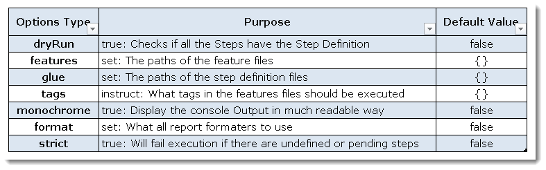

# Tutoriel de prise en main de Cucumber

*Ce tutoriel s'inspire de l'exemple Shakespeare
du [Kata Cucumber/Mockito](https://github.com/CodingDojoPolytech/cucumber-mockito-shakespeare)
de [Sébastien Mosser](https://twitter.com/petitroll)*

**[Cucumber](https://cucumber.io/)** est un framework de tests pour le **B**ehavior **D**riven **D**evelopment,
initialement développé en Ruby, mais proposant
aujourd'hui [différentes implémentations pour de nombreux autres langages de programmation](https://docs.cucumber.io/installation).
Le site de référence est: **[cucumber.io](https://cucumber.io)**.

Dans l'écosystème Java, [Cucumber](https://cucumber.io/) est aujourd'hui un des frameworks BDD les plus utilisés.

Comme tout framework adapté au BDD, [Cucumber](https://cucumber.io/) permet de transformer les scénarii d'une story (
écrits sous forme d'exemples en *langage naturel* au format *Gherkin*) en tests java automatisés. Dans le principe,
cette transformation est possible à l'aide du framework de tests [JUnit](http://junit.org/). Chaque **étape d'un
scénario** est implémentée comme une **méthode java, appelée step**. Le lien entre la description textuelle de l'étape
et le code Java de la step est réalisé via des annotations.

Dans ce tutoriel, nous verrons comment:

* [Installer le plug-in Cucumber](#plugInCucumber)
* [Mettre en place votre premier projet Cucumber](#mettrePlaceProjetCucumber)
    * [1. Créer un projet Maven](#creerProjetMaven)
    * [2. Configurer le `pom.xml` pour Cucumber](#configurerPom)
    * [3. Décrire le comportement en langage naturel (`.feature`)](#comportementLangageNaturel)
    * [4. Configurer le lanceur de tests](#configurerLanceurDeTests)
    * [5. Implémenter le code de test des *steps* (méthodes java)](#implementerStepsJava)
    * [6. Implémenter le code métier de l'application](#implementerCodeMetier)

Mais aussi, comment:

* [Paramétrer les steps à l'aide d'expressions régulières](#parametrerStepsRegEx)
* [Alléger la lecture d'un scénarios (`And` et `But`)](#allegerLectureScenario)
* [Paramétrer un scénario](#parametrerScenario)
* [Factoriser des scénarios](#factoriserScenario)
* [Paramétrer le lanceur de test à partir de `@CucumberOptions`](#CucumberOptions)
* [Produire un *beau* rapport à l'aide du plug-in `cucumber-reporting`](#CucumberReporting)
* [Remarques complémentaires](#remarquesComplementaires)

<!-- * Vers une documentation vivante à l'aide de CukeDoctor : à venir ... -->

## Installer le plug-in Cucumber <a id="plugInCucumber"></a>

Dans l'ide de choix, installer le plugin cucumber.

## Mettre en place votre premier projet Cucumber <a id="mettrePlaceProjetCucumber"></a>

### 1. Créer un projet Maven <a id="creerProjetMaven"></a>

- Créer un projet maven à appeler, par exemple, `cucumber_course`.

### 2. Configurer le `pom.xml` pour Cucumber <a id="configurerPom"></a>

Mettre à jour votre `pom.xml` avec les trois dépendances suivantes.

* la première pour pouvoir utiliser Cucumber. Nous avons choisi une dépendance classique: `cucumber-java` (pas
  d'utilisation de lambda dans ce tutoriel) comme indiqué
  dans [la partie Installation de la documentation Cucumber spécifique à Java](https://docs.cucumber.io/installation/java/).
* les deux dépendances suivantes `cucumber-junit` et `junit` pour pouvoir exécuter les scénarii Cucumber dans **JUnit**
  à l'aide du **JUnit Runner** comme indiqué
  dans [la partie Checking Assertions de la documentation de Cucumber](https://docs.cucumber.io/cucumber/checking-assertions/#java).
  Chaque étape de scénario, considérée alors comme un test spécifique, pourra ainsi être directement visualisée dans la
  vue JUnit de l'IDE.

```XML

<dependencies>
    <dependency>
        <groupId>io.cucumber</groupId>
        <artifactId>cucumber-java</artifactId>
        <version>7.18.0</version>
        <scope>test</scope>
    </dependency>
    <dependency>
        <groupId>io.cucumber</groupId>
        <artifactId>cucumber-junit</artifactId>
        <version>7.18.0</version>
        <scope>test</scope>
    </dependency>
    <dependency>
        <groupId>org.junit.jupiter</groupId>
        <artifactId>junit-jupiter</artifactId>
        <version>5.10.2</version>
        <scope>test</scope>
    </dependency>
</dependencies>
```

Une fois, le `pom.xml` modifié, n'oubliez pas de relancer `Maven -> Update Project...` ou `mvn clean install`

### 3. Décrire le comportement en langage naturel (`.feature` dans `src/test/resources`) <a id="comportementLangageNaturel"></a>

Créer un nouveau `Source Folder` que vous appelerez `src/test/resources`.

Créer un fichier `cocktail.feature` dans un package `dojo` de `src/test/resources`.

Le plug-in Cucumber reconnait l'extension `.feature`.

Recopier ensuite dans ce fichier le récit de la story suivante et enregister le:

```GHERKIN
Feature: Cocktail Ordering

  As Romeo, I want to offer a drink to Juliette so that we can discuss together (and maybe more).

  Scenario: Creating an empty order
    Given Romeo who wants to buy a drink
    When  an order is declared for Juliette
    Then  there is no cocktail in the order  
```

Dans **Cucumber**, une **story** est composée de *scénarii* et chaque **scénario** est composé d' **étapes**. La story
est (d)écrite en Gherkin dans un fichier `.feature` dans lequel on trouve:

* le **titre** de la story introduit par le mot clé **`Feature`**:
  `Feature: <Titre de la fonctionnalité>`
* Un **descriptif (optionnel)** (qui ne sera pas interprété par Cucumber) permettant par exemple, de résumer la story à
  l'aide du template `As..., I want to..., so that ....`
  et/ou de noter toutes autres informations utiles à connaître.
* les **scénarii** de la story:
    - Chaque scénario est introduit par le mot clé **`Scenario`**. Ce mot clé peut être suivi ou non d'un titre qui
      décrit explicitement le critère d'acceptance de la story associé à ce scénario.
    - Un scénario étant un exemple concret qui illustre une règle métier, il est composé de plusieurs **étapes**. Les
      différentes étapes d'un scénario sont décrites à partir des 3 principaux mots clés: **`Given`**, **`When`** et *
      *`Then`** suivant la place et le rôle qu'elles occupent dans le scénario:
        - `Given` décrit les conditions initiales du scénario, c-a-d le contexte dans lequel va se dérouler le scénario.
        - `When` décrit une action effectuée par un utilisateur, c-a-d un événement qui va réellement déclencher le
          scénario.
        - `Then` décrit le comportement attendu, ce qui devrait se produire lorsque les conditions initiales sont
          remplies et l'action est effectuée.

Pour en savoir plus, la documentation de Cucumber propose deux rubriques sur les étapes (*steps*) **Given-When-Then**
consultables [ici](https://docs.cucumber.io/gherkin/reference/#steps)
et [là](https://docs.cucumber.io/cucumber/api/#steps).

Cucumber propose quelques mots clés supplémentaires comme `Background`, `And`, `But`, `Scenario Outline` et `Examples`
que nous verrons un peu plus loin.

*Remarque*: une présentation complète de la grammaire utilisée par Cucumber est consultable dans la
rubrique [Gherkin Syntax](https://docs.cucumber.io/gherkin) de la documentation de Cucumber.

### 4. Configurer le lanceur de tests (dans `src/test/java`) <a id="configurerLanceurDeTests"></a>

Le lanceur de tests permet de configurer l'environnement de tests des scénarii.

#### 4.1. Création d'un fichier `edu.one.dojo.steps.RunCucumberTest.java` dans un package `dojo` de `src/test/java`

Implémenter ce fichier de manière à ce qu'il devienne le lanceur des tests Cucumber:

```JAVA  
package dojo;

import io.cucumber.junit.Cucumber;
import org.junit.runner.RunWith;

@RunWith(Cucumber.class)
public class edu.one.dojo.steps.RunCucumberTest{
        }
```

L'annotation `@RunWith(Cucumber.class)` permet d'exécuter les scénarii Cucumber dans **JUnit** à l'aide du **JUnit
Runner**.

*Remarque*: pour l'instant, la configuration du lanceur de tests est minimale.
La configuration peut être personnalisée via des options de configuration prédéfinies et consultables dans
la [rubrique Running Cucumber du manuel de référence](https://docs.cucumber.io/cucumber/api/#running-cucumber). Ces
options seront transmises via l'annotation `@CucumberOptions`: nous ajouterons certaines options par la suite.

#### 4.2. Exécution du lanceur de tests (`edu.one.dojo.steps.RunCucumberTest.java`)

Pour exécuter les scénarii du fichier `.feature`, il suffit désormais d'exécuter le lanceur de
tests `edu.one.dojo.steps.RunCucumberTest`
comme un simple fichier **`JUnit`** via la commande habituelle (`Run As -> JUnit Test`).

Il ne vous reste donc plus qu'à **lancer vos scénarii et consulter la console.**

Le lanceur de tests fait le mapping entre les **étapes** des scénarii écrites de manière naturelle (fichier `.feature`)
et les méthodes Java implémentant ces étapes. Les étapes Java sont appelées des **steps** et sont définies grâce à des
annotations spécifiques: **`@Given`**, **`@When`**, **`@Then`**.

À ce point du tutoriel, le fichier contenant les **steps** n'existe pas encore.

C'est pourquoi, le rapport de tests dans la console propose, pour chaque étape du fichier `.feature`, un squelette de *
*step** (annoté et paramétré) qu'il ne reste plus qu'à implémenter pour réaliser le mapping entre les scénarii Cucumber
et le code métier java.

*Remarque*: *si vous ne voyez pas le rapport de tests dans la console, c'est que vous n'avez surement pas enregistré le
fichier `cocktail.feature` au bon endroit c-a-d dans un package `dojo` du source folder `src/test/resources`.*
<!-- Au pire ajouter : @CucumberOptions(features = ".")-->

### 5. Implémenter le code de test des *steps* (méthodes java) (dans `src/test/java`) <a id="implementerStepsJava"></a>

Créer un fichier `edu.one.dojo.steps.CocktailSteps.java` dans un package `dojo` de `src/test/java`.

#### 5.1. Le *squelette* des steps issu du rapport de tests de la console

Implémenter ce fichier de **steps** en **copiant/collant le rapport de tests fourni par la console** (moins fastidieux
et plus sûr que d'écrire le mapping *à la main*)

**Ajouter ensuite les `import`** nécessaires à une bonne compilation afin d'obtenir un code similaire au suivant:

```JAVA
package dojo;

import cucumber.api.PendingException;
import cucumber.api.java.en.Given;
import cucumber.api.java.en.Then;
import cucumber.api.java.en.When;

public class edu.one.dojo.steps.CocktailSteps{

@Given("Romeo who wants to buy a drink")
public void romeo_who_wants_to_buy_a_drink(){
        // Write code here that turns the phrase above into concrete actions
        throw new PendingException();
        }

@When("an order is declared for Juliette")
public void an_order_is_declared_for_Juliette(){
        // Write code here that turns the phrase above into concrete actions
        throw new PendingException();
        }

@Then("there is no cocktail in the order")
public void there_is_no_cocktail_in_the_order(){
        // Write code here that turns the phrase above into concrete actions
        throw new PendingException();
        }
        }
```

Chaque **step** commence par une annotation spécifique: `@Given` ou, `@When` ou `@Then`.

Pour que le mapping existe entre la **step** (`.java`) et l'**étape** d'un scénario (`.feature`) la **valeur de
l'annotation java** doit contenir la **phrase décrivant l'étape du scénario** à quelques caractères spéciaux près.  
Pour plus de renseignements, consultez la rubrique [**Step Definitions
** du manuel de reférence](https://docs.cucumber.io/cucumber/step-definitions)

#### 5.2 La configuration du lanceur de tests pour une *step dite PENDING*

Pour l'instant chaque ***step*** lance juste une `PendingException`.  
On dit qu'une ***step*** est **PENDING** lorsque le mapping entre le langage naturel et le code n'a pas encore été
réalisé.

**Exécuter le lanceur de tests et consulter la vue JUnit.**

Vous remarquerez que tous les tests sont au ROUGE, et que la console indique la présence
de `io.cucumber.java.PendingException: TODO: implement me` ce qui signifie qu'une implémentation des steps est attendue.

**_(DEPRECATED)_ Ajouter l'annotation `@CucumberOptions(strict = true)`** à la
classe `edu.one.dojo.steps.RunCucumberTest`:

Il est possible de faire en sorte que les tests soient au ROUGE lorsque une(des) step(s) reste(nt) à implémenter. Pour
cela il est nécessaire de configurer le lanceur de test `edu.one.dojo.steps.RunCucumberTest` à l'aide de l'
annotation `@CucumberOptions` et
de l'option `strict` à `true`.

```JAVA

@RunWith(Cucumber.class)
@CucumberOptions(strict = true)
public class edu.one.dojo.steps.RunCucumberTest{
        }
```

Cette option n'est plus possible à partir de la version 7 de cucumber.

#### 5.3. L'implémentation des steps en Java pour produire le comportement attendu

Il est maintenant nécessaire d'implémenter chaque step de manière à ce qu'elle produise le comportement attendu du
scénario et puisse ainsi être exécutée en Java.

##### Zoom sur la première step Java

Par exemple, la première étape du scénario: `Given Romeo who wants to buy a drink` devient exécutable en Java, dès lors
qu'on lui associe le code suivant qui est une traduction possible de manière algorithmique du comportement attendu:

```JAVA
public class edu.one.dojo.steps.CocktailSteps{

private Order order;

@Given("Romeo who wants to buy a drink")
public void romeo_who_wants_to_buy_a_drink(){
        order=new Order();
        order.declareOwner("Romeo");
        }

        //...
        }
```

*Remarque*: ceci est une *proposition* pour rendre l'étape `Given Romeo who wants to buy a drink` exécutable, donc une
proposition de conception pour notre application de cocktails.
On dit qu'ici *le développement est dirigé par le comportement (Behavior Driven Developement), dans le sens où le
comportement de la story (décrit au travers des différentes étapes de son scénario) permet de faire émerger une API
publique pour l'application.*.

Cette première step a ainsi permis de faire apparaître une classe **`Order`** et sa méthode **`declareOwner`** (qu'il ne
restera plus qu'à implémenter pour faire passer la *step* au VERT...)

##### Une implémentation possible pour la deuxième step:

```JAVA
public class edu.one.dojo.steps.CocktailSteps{
//...

@When("an order is declared for Juliette")
public void an_order_is_declared_for_juliette(){
        order.declareTarget("Juliette");
        }
        //...
        }  
```

##### Une implémentation possible pour la troisième step:

```JAVA  
import static org.junit.Assert.*;

import java.util.List;

public class edu.one.dojo.steps.CocktailSteps{
//...
@Then("there is no cocktail in the order")
public void there_is_no_cocktail_in_the_order(){
        List<String> cocktails=order.getCocktails();
        assertEquals(0,cocktails.size());
        }
        }
```

Implémenter les trois steps avec le code proposé précédemment.

Supprimer les erreurs de compilation en vous aidant de votre IDE, pour créer automatiquement (en gardant pour l'instant
l'implémentation vide par défaut proposée par l'IDE):

* une classe `Order`dans le package `dojo` de `src/main/java`
* et ses méthodes: `declareOwner`, `declareTarget` et `getCocktails`

Le scénario Gherkin du fichier `.feature` est désormais transformé en code java exécutable.  
L' `assertEquals` de la step `@Then` montre bien que ce scénario est en fait transformé en un test appelé **test
d'acceptance** (puisqu'on se situe au niveau de la story donc des exigences du client).

Exécuter le scénario via `edu.one.dojo.steps.RunCucumberTest` revient à exécuter ce test.

Essayer d'exécuter le fichier `edu.one.dojo.steps.RunCucumberTest` pour voir ce qui se passe.
Que constatez-vous ?
La step `@Then` échoue: c'est normal car pour le moment nous n'avons rien implémenté...

### 6. Implémenter le code métier de l'application <a id="implementerCodeMetier"></a>

L'idéal dans un développement agile est bien sûr d'implémenter le code métier en TDD.

Pour ce tutoriel, contentez-vous de recopier l'implémentation suivante pour votre classe `Order`:

```JAVA
package dojo;

import java.util.ArrayList;
import java.util.List;

public class Order {

    private String from;
    private String to;
    private List<String> contents = new ArrayList<String>();

    public void declareOwner(String romeo) {
        this.from = romeo;
    }

    public void declareTarget(String juliette) {
        this.to = juliette;
    }

    public List<String> getCocktails() {
        return contents;
    }
}
```

Exécuter le fichier `edu.one.dojo.steps.RunCucumberTest`. Que constatez-vous ?
La step `@Then` est *au VERT*: le `Scenario: Creating an empty order` est exécuté par le programme java avec succès.   
Ce scénario est donc devenu une **spécification exécutable**, puisque exécuter ce scénario revient maintenant à tester
automatiquement (et donc à exécuter) le code métier.

**En résumé**: outre [créer un projet Maven](#creerProjetMaven)
et [configurer le `pom.xml` pour Cucumber](#configurerPom), la
mise en place de tests fonctionnels automatisés a nécessité:

1. de [décrire le comportement en langage naturel (`.feature`)](#comportementLangageNaturel)
2. d'[implémenter le code de test des *steps* (méthodes java)](#implementerStepsJava)
3. d'[implémenter le code métier de l'application](#implementerCodeMetier)
4. et 5. d'exécuter les tests jusqu'à ce qu'ils passent au VERT! sans oublier bien sûr
   de [configurer le lanceur de tests (`edu.one.dojo.steps.RunCucumberTest.java`) ](#configurerLanceurDeTests)

## Paramétrer les steps <a id="parametrerStepsRegEx"></a>

Pour l'instant, notre scénario met uniquement en scène *Roméo* et *Juliette*.
Mais ne pourrait-on pas imaginer un nouveau scénario (nouvel exemple) où *Tom*  souhaiterait prendre un verre avec
*Jerry*?

```GHERKIN

Scenario: Creating another new empty order
Given Tom who wants to buy a drink
When  an order is declared for Jerry
Then  there is no cocktail in the order

```

***On ne vous demande pas d'écrire ce scénario pour le moment, juste d'en prendre connaissance*** et de constater que ce
scénario reprend les étapes du scénario précédent à deux paramètres près: *Tom* et *Jerry* au lieu de *Roméo* et
*Juliette*. Il soulève ainsi la question de se savoir comment paramétriser les steps `@Given`, `@When` et `@Then` dans
le code java afin d'éviter la duplication de code...

Cucumber permet cela en proposant deux solutions :

- Expressions régulières : Les Expressions régulières offrent plus de flexibilité et sont utilisées pour des
  correspondances de motifs plus complexes. Cependant, elles peuvent être moins lisibles et nécessitent une syntaxe plus
  précise.
- Expressions Cucumber : Les Expressions Cucumber sont conçues pour être simples à lire et à écrire. Elles permettent de
  capturer des variables directement à partir des étapes des scénarios en utilisant des crochets {}.

### Expression Cucumber - Heuristiques Java

Java ne fournit pas de syntaxe littérale pour les expressions régulières, elles doivent donc être spécifiées sous forme
de chaînes. Cucumber utilise des heuristiques pour déterminer si une chaîne doit être interprétée comme une Expression
Cucumber ou une Expression Régulière.

Le tableau ci-dessous décrit les heuristiques, ainsi que quelques exemples :

| Expression                                            | Type               | Explication                                                                                              |
|-------------------------------------------------------|--------------------|----------------------------------------------------------------------------------------------------------|
| les chaînes sont des expressions cucumbers par défaut | CucumberExpression | Lorsqu'il n'y a pas de caractères spéciaux, une Expression Cucumber est toujours supposée.               |
| ^définitivement une regexp$                           | RegularExpression  | La présence d'ancres suppose une Expression Régulière, même si une seule des ancres est présente.        |
| /sûrement une regexp/                                 | RegularExpression  | Les barres obliques supposent toujours une Expression Régulière. Les barres elles-mêmes sont supprimées. |

Cucumber permet cela en proposant l'utilisation d'expressions régulières (regex) dans les steps Java pour matcher (
détecter) un motif dans la description textuelle d'une étape. Par exemple:

* l'expression **`(.*)`** permettra de matcher un **string**
* l'expression **`(\\d+)`** permettra de matcher un **entier**

*Remarques:*

* Un exemple d'expression régulière concernant les entiers est d'ailleurs donné
  dans [la partie Steps Definitions du manuel de référence Cucumber](https://docs.cucumber.io/cucumber/step-definitions) (
  veillez bien à choisir le langage java qui devrait vous afficher: `@Given("^I have (\\d+) cukes in my belly$"`)
* Besoin d'un petit rappel sur les regex ?:
    * une liste des expressions régulières Cucumber peut être
      consultée [ici](http://agileforall.com/wp-content/uploads/2011/08/Cucumber-Regular-Expressions-Cheat-Sheet.pdf).
    * une liste des expressions régulières avec l'API Regex de Java peut être
      consultée [ici](http://cyberzoide.developpez.com/tutoriels/java/regex/).

Pour la suite du tutoriel, nous allons donc commencer par refactorer le code existant du scénario *Roméo* et *Juliette*
en le paramétrant avant d'ajouter un nouveau scénario...

### 1. Paramétrer les steps Java

#### Paramétrer la step `@Given`

Pour paramétrer le nom de la personne qui veut prendre un verre il faut donc dans le code Java:

* ajouter l'expression **`(.*)`** à la place de `Romeo` dans l'annotation `Given`.
* ajouter un paramètre de type `String romeo` dans la signature de la méthode.
* passer le paramètre `romeo` dans la méthode `declareOwner` à la place de la valeur `"Romeo"`.

Le code de la nouvelle step `@Given` devient donc:

```JAVA
@Given("^(.*) who wants to buy a drink$")
public void romeo_who_wants_to_buy_a_drink(String romeo){
        order=new Order();
        order.declareOwner(romeo);
        }  
```

Modifier le code de la step `@Given` et exécuter `edu.one.dojo.steps.RunCucumberTest` afin de s'assurer que les tests
passent toujours
au
VERT!

#### Paramétrer la step `@When`

Paramétrer cette step revient à paramétrer le nom de la personne pour qui on commande un verre.

Paramétrer la step `@When` revient à écrire le code suivant:

```JAVA
@When("an order is declared for (.*)")
public void an_order_is_declared_for_Juliette(String juliette){
        order.declareTarget(juliette);
        }  
```

Modifier le code de la step `@When` et exécuter `edu.one.dojo.steps.RunCucumberTest` afin de s'assurer que les tests
passent toujours
au
VERT!

#### Paramétrer la step `@Then`

Paramétrer cette step revient à paramétrer le nombre de cocktails dans la commande.

En l'état actuel, il faut refactorer à deux niveaux:

* **dans l'étape textuelle du scénario** (fichier `cocktail.feature`) : commencer par remplacer le `no` par `0` et
  rajouter un `s` à `cocktails` (en prévision de la réutilisabilité de cette étape par la suite) de manière à obtenir: *
  *`Then  there is 0 cocktails in the order`**
* **dans la step `@Then`**(fichier `edu.one.dojo.steps.CocktailSteps.java`) : paramétrer le nombre de cocktails comme un
  entier grâce à
  l'expression **`(\\d+)`** (et **ne pas oublier de rajouter des `s` à `cocktails`**) et utiliser le
  paramètre `nbCocktails` de manière à obtenir:

```JAVA  
@Then("there is (\\d+) cocktails in the order")
public void there_is_nb_cocktails_in_the_order(int nbCocktails){
        List<String> cocktails=order.getCocktails();
        assertEquals(nbCocktails,cocktails.size());
        }  
```

Modifier le texte de l'étape `Then` et le code de la step `@Then` et exécuter `edu.one.dojo.steps.RunCucumberTest` afin
de s'assurer
que
les tests passent toujours au VERT!

### 2. Ecriture d'un nouveau scénario à l'aide du plug-in Cucumber

Le plug-in Cucumber propose via **`Ctrl+Espace`** une autocomplétion dans l'éditeur de scénarios (pour
les `.feature`).
Nous allons maintenant tester cette autocomplétion en ajoutant un nouveau scénario au fichier `cocktail.feature`.

Placez-vous en fin de fichier `cocktail.feature` sur une nouvelle ligne vide.
Un appel à `Ctrl+Espace` propose une liste de mots clés utilisables à cet emplacement.  
Choisir **`Scenario`** et compléter la ligne par l'intitulé du scénario, par exemple
**`Scenario: Creating another new empty order`**.

Cette fois-ci l'exemple de ce nouveau scénario concernera **Tom** et **Jerry**.

#### 2.1. Première étape du scénario (Given)

Passer à la ligne suivante pour écrire la première étape du scénario.

* Un premier `Ctrl+Espace` permet de sélectionner le mot clé **`Given`**.
* Un second `Ctrl+Espace` affiche les steps déjà écrites dans le fichier java. Choisir la
  première `who wants to buy a drink` et remplacer le `(.*)` par `Tom` de manière à obtenir comme première étape de ce
  nouveau scénario: **` Given Tom who wants to buy a drink `**

*Remarque*: il se peut que la deuxième autocomplétion `Ctrl+Espace` ne veuille pas afficher les steps déjà écrites. Cela
peut arriver si les steps du premier scénario présentent un petit symbole de warning jaune indiquant
l'erreur `Step '...' does not have a matching glue code`. Si tel est le cas, rafraîchir le fichier `cocktail.feature`
avec un `F5` par exemple afin de faire disparaître ce symbole.*

#### 2.2. Deuxième étape du scénario (When)

Passer à la ligne suivante pour écrire la deuxième étape du scénario.

De la même manière, en vous aidant de l'autocomplétion `Ctrl+Espace`, écrire: **`When an order is declared for Jerry`**

#### 2.3. Troisième étape du scénario (Then)

Passer à la ligne suivante pour écrire la troisième étape du scénario: **`Then there is 0 cocktails in the order`**

N'oublier pas d'indenter correctement le fichier `.feature`.

### 3. Exécution du nouveau scénario

Comme nous avons utilisé des steps (paramétrées) déjà implémentées dans le
fichier `edu.one.dojo.steps.CocktailSteps.java`, il est possible
de passer directement à l'exécution de ce nouveau scénario.

Exécuter le fichier `edu.one.dojo.steps.RunCucumberTest`.
La vue JUnit vous indique maintenant que les deux scénarios passent bien au VERT!

## Alléger la lecture d'un scénario (`And` et `But`) <a id="allegerLectureScenario"></a>

Nous allons maintenant ajouter un nouveau scénario dans `cocktail.feature`.  
Pour envoyer un message (de mots doux ?) à la cible en même temps que la commande est demandée, écrire le scénario
suivant pourrait être une solution :

```GHERKIN
 Scenario: Sending a message with an order
Given Romeo who wants to buy a drink
When  an order is declared for Juliette
When  a message saying "Wanna chat?" is added
Then the ticket must say "From Romeo to Juliette: Wanna chat?"
```

En fait, pour alléger la lecture d'un scénario, le [Gherkin](https://docs.cucumber.io/gherkin/reference) propose deux
autres mots clés `And` et `But` qui permettent juste de mettre de l'emphase dans le texte. Ces deux mots clés n'auront
aucun effet au niveau de l'implémentation du scénario, puisqu'ils reprennent juste le mot-clé précédent.

Nous préférons donc écrire dans `cocktail.feature` le scénario suivant (avec le mot clé `And`):

```GHERKIN
 Scenario: Sending a message with an order
Given Romeo who wants to buy a drink
When  an order is declared for Juliette
And  a message saying "Wanna chat?" is added
Then the ticket must say "From Romeo to Juliette: Wanna chat?"
```

Formatter et enregistrer `cocktail.feature` puis exécuter `edu.one.dojo.steps.RunCucumberTest.java`.

Consulter la console, deux nouvelles steps sont proposées:

* une avec l'annotation `@Then` ;
* et l'autre avec l'annotation `@When` (qui correspond bien à notre étape de scénario commençant par un `And` précédé
  par `When`).

Récuperer dans la console le squelette d'implémentation de ces nouvelles steps et copier/coller les dans le
fichier `edu.one.dojo.steps.CocktailSteps.java` afin de procéder à leur implémentation qui pourrait être par exemple:

```JAVA
@When("a message saying {string} is added")
public void a_message_saying_is_added(String something){
        order.withMessage(something);
        }

@Then("the ticket must say {string}")
public void the_ticket_must_say(String somethingElse){
        assertEquals(somethingElse,order.getTicketMessage());
        }
```

*Remarque* : les versions récentes de Cucumber permettent d'utiliser des **Cucumber Expressions** à la place des
expressions régulières (regex) pour faciliter l'écriture et la lecture des steps.
Ainsi, l'annotation `@When` peut être écrite indifféremment :

* soit à partir d'une **Cucumber Expression** (c'est ce que génère dorénavant la console, ici avec le *parameter type*
  par défaut `{string}`) :  `@When("a message saying {string} is added")`
* soit à partir d'une **expression régulière** (regex) :`@When("a message saying \"([^\"]*)\" is added")`

Quant à l'annotation `@Then`, elle peut être écrite indifféremment :

* soit à partir d'une **Cucumber Expression** : `@Then("the ticket must say {string}")`
* soit à partir d'une **expression régulière** (regex) :`@Then("the ticket must say \"([^\"]*)\"")`

Pour connaître les **parameter types** proposés par défaut comme Cucumber Expressions, n'hésitez pas à consulter
la [partie **Cucumber Expressions
** de la documentation de Cucumber](https://docs.cucumber.io/cucumber/cucumber-expressions/) qui indique également
comment ajouter ses propres types ainsi que la [partie **Snippets
** de la documentation Cucumber sur la définition des steps](https://docs.cucumber.io/cucumber/step-definitions/#snippets).*

Il ne reste plus qu'à procéder à l'implémentation du code métier dans la classe `Order` des méthodes `withMessage`
et `getTicketMessage`

``` JAVA
public class Order {
	//...
	private String message;

	//...
	public void withMessage(String something) {
		this.message = something;
	}

	public String getTicketMessage() {
		return "From " + from + " to " + to + ": " + message;
	}
    }
```

Relancer `edu.one.dojo.steps.RunCucumberTest.java` et constater que tous les scénarios passent au VERT!

Récapitulons, le mot clé **`And`** permet d'ajouter une étape supplémentaire au scénario pour alléger sa lecture. Ce mot
clé ne peut se trouver qu'après un des trois mots clés de base *`Given`*, *`When`*, ou *`Then`* ou après un autre `And`.
Il peut y avoir autant de `And` que le nécessite la description. Il en est de même pour le mot clé `But`.

## Paramétrer un scénario <a id="parametrerScenario"></a>

### Un premier scénario paramétré ...

Reprendre l'ensemble des scénarios du fichier `cocktail.feature`:

```GHERKIN
  Scenario: Creating an empty order
Given Romeo who wants to buy a drink
When an order is declared for Juliette
Then there is 0 cocktails in the order

Scenario: Creating another new empty order
Given Tom who wants to buy a drink
When an order is declared for Jerry
Then there is 0 cocktails in the order

Scenario: Sending a message with an order
Given Romeo who wants to buy a drink
When an order is declared for Juliette
And a message saying "Wanna chat?" is added
Then the ticket must say "From Romeo to Juliette: Wanna chat?"  
```

La lecture des deux premiers scénarii montrent une duplication dans le descriptif des étapes.
Il est possible de factoriser ces descriptions et de les regrouper au sein d'un même scénario dit **paramétré** grâce au
mot clé  **`Examples`** pour en faciliter la lecture.

Remplacer les deux premiers scénarii par le **scénario paramétré** suivant et indenter correctement le
fichier `.feature` (via un clic droit et le menu **Pretty Format**):

```GHERKIN

Scenario Outline: Creating an empty order
Given <from> who wants to buy a drink
When an order is declared for <to>
Then there is <nbCocktails> cocktails in the order

Examples:
| from  | to       | nbCocktails |
| Romeo | Juliette |           0 |
| Tom   | Jerry    |           0 |
```

Le **scénario paramétré** commence par le mot clé **`Scenario Outline`**.  
Il est rédigé comme un scénario classique avec, dans les étapes, des ***paramètres*** notés entre **`<`** et **`>`**:
c'est une sorte de *template* de scénario.

Lors de l'exécution, les *paramètres* seront remplacés par les valeurs présentes dans les lignes de la table introduite
par le mot clé **`Examples`**.    
**Lors de l'exécution, il y aura donc autant de scénarios exécutés que d'exemples (lignes valuées) présents dans la
table `Examples`**.

Exécuter `edu.one.dojo.steps.RunCucumberTest.java` et constater que tous les scénarii passent au VERT!  
Consulter la console qui vous indique bien que `3 Scenarios` et `10 Steps` ont été exécutés.  
Consulter la vue JUnit pour vérifier que tous les scénarii passent au VERT!
De plus, en déroulant et ouvrant complètement toute la vue JUnit, vous verrez bien apparaître les 3 scénarii...

Un petit test pour bien s'en assurer tout de même...
Changer un **`0`** de la colonne **`nbCocktails`** de la table **`Examples`** en **`1`**.  
Relancer les tests via `edu.one.dojo.steps.RunCucumberTest.java`.  
Constater via la console et la vue JUnit que tous les tests ne passent plus.

**Pour continuer le tutoriel, remettre que des `0` de la colonne `nbCocktails` et
exécuter `edu.one.dojo.steps.RunCucumberTest.java`
afin
de s'assurer que tous les tests passent au VERT!**

### Un autre scénario paramétré...

Et si on paramétrait maintenant le dernier scénario, le fichier `cocktail.feature` pourrait ressembler à:

```GHERKIN
    Feature: Cocktail Ordering

  As Romeo, I want to offer a drink to Juliette so that we can discuss together (and maybe more).

  Scenario Outline: Creating an empty order
    Given <from> who wants to buy a drink
    When an order is declared for <to>
    Then there is <nbCocktails> cocktails in the order

    Examples:
      | from  | to       | nbCocktails |
      | Romeo | Juliette | 0           |
      | Tom   | Jerry    | 0           |

  Scenario Outline: Sending a message with an order
    Given <from> who wants to buy a drink
    When an order is declared for <to>
    And a message saying "<message>" is added
    Then the ticket must say "<expected>"

    Examples:
      | from  | to       | message     | expected                            |
      | Romeo | Juliette | Wanna chat? | From Romeo to Juliette: Wanna chat? |
      | Tom   | Jerry    | Hei!        | From Tom to Jerry: Hei!             |
````

Transfomer votre fichier `cocktail.feature` de manière à ce qu'il contienne désormais ces deux `Scenario Outline`,
indenter le correctement (via un clic droit et **Pretty Format**) et exécuter `edu.one.dojo.steps.RunCucumberTest.java`
pour vous
assurer
que tous les tests passent au VERT!

*Remarque*: la console indique désormais `4 Scenarios` et `14 Steps`.

**Pour en savoir plus, une documentation en ligne sur `Scenario Outline` est disponible** dans
la [partie Gherkin Reference de la documentation Cucumber](https://docs.cucumber.io/gherkin/reference/#scenario-outline).

## Factoriser des scénarios <a id="factoriserScenario"></a>

Pour montrer comment factoriser des scénarii, nous allons un peu modifier nos exemples précédents et considérer que
dorénavant, seul Roméo (plus de Tom dans nos scénarios) offre un verre aux gentes demoiselles.
Pour commencer, modifier donc votre fichier `cocktail.feature` de la manière suivante pour faire apparaître
un `Scenario` et un `Scenario Outline`:

```GHERKIN

Feature: Cocktail Ordering

  As Romeo, I want to offer a drink to Juliette so that we can discuss together (and maybe more).

  Scenario: Creating an empty order
    Given Romeo who wants to buy a drink
    When an order is declared for Juliette
    Then there is 0 cocktails in the order

  Scenario Outline: Sending a message with an order
    Given Romeo who wants to buy a drink
    When an order is declared for <to>
    And a message saying "<message>" is added
    Then the ticket must say "<expected>"

    Examples:
      | to       | message     | expected                            |
      | Juliette | Wanna chat? | From Romeo to Juliette: Wanna chat? |
      | Jerry    | Hei!        | From Romeo to Jerry: Hei!           |

```

Exécuter `edu.one.dojo.steps.RunCucumberTest.java` et vérifier que tous les tests passent au VERT!  
*Remarque*: la console indique désormais `3 Scenarios` et `11 Steps`

La lecture des scénarii montre une duplication dans les étapes `Given`, notamment avec
l'étape:  `Given Romeo who wants to buy a drink`.

Il est possible de factoriser une(ou plusieurs) étape(s) `Given` en utilisant le mot clé `Background` en amont de la
description des scénarii de la manière suivante:

```GHERKIN

Feature: Cocktail Ordering

  As Romeo, I want to offer a drink to Juliette so that we can discuss together (and maybe more).

  Background:
    Given Romeo who wants to buy a drink

  Scenario: Creating an empty order
    When an order is declared for Juliette
    Then there is 0 cocktails in the order

  Scenario Outline: Sending a message with an order
    When an order is declared for <to>
    And a message saying "<message>" is added
    Then the ticket must say "<expected>"

    Examples:
      | to       | message     | expected                            |
      | Juliette | Wanna chat? | From Romeo to Juliette: Wanna chat? |
      | Jerry    | Hei!        | From Romeo to Jerry: Hei!           |
```

Modifier votre fichier `cocktail.feature` pour faire apparaître la section `Background`.

Exécuter `edu.one.dojo.steps.RunCucumberTest.java` et vérifier que tous les tests passent au VERT!  
*Remarque*: la console indique toujours `3 Scenarios` et `11 Steps`

La **section `Background`** permet donc de répéter les mêmes étapes `Given`dans tous les scénarii.  
Les étapes décrites dans le `Background` seront exécutées en préalable à tous les `Scenario` et `Scenario Outline` du
fichier `.feature`.  
Pour faire un parallèle avec un framework de tests unitaires en Java, on peut dire que la section **`Background`** (pour
les tests fonctionnels) dans **Cucumber** joue en quelque sorte le même rôle que l'annotation  **`@Before`** (pour les
tests unitaires) dans **JUnit**.

**Pour en savoir plus, une documentation en ligne sur `Background` est disponible** dans
la [partie Gherkin Reference de la documentation Cucumber](https://docs.cucumber.io/gherkin/reference/#background).

## Paramétrer le lanceur de test  à partir de `@CucumberOptions` <a id="CucumberOptions"></a>



Pour paramétrer le lanceur de test `JUnitRunner`, des options de configurations peuvent lui être transmises via
l'annotation `@CucumberOptions`.

La liste d'options de configuration est disponible dans le manuel de référence (
partie [Options et List configuration options](https://docs.cucumber.io/cucumber/api/#options)).

Nous allons nous intéresser à ces options:

* l'option `feature` pour indiquer où se trouvent les scénarii à tester ;
* l'option `plug-in` pour générer un rapport de tests.
* l'option `monochrome` pour améliorer la lisibilité dans la console des résultats liés à l'exécution des scénarios ;

### L'option `feature` pour indiquer où se trouvent les scénarios à tester

**Peut-être, au cours de ce tutoriel, vous êtes-vous demandé pourquoi les `.feature` avaient été enregistrées dans le
dossier `src/test/resources` dans un package de même nom que celui du lanceur de test ?**

Lorsqu'on travaille avec un projet maven, il est d'usage d'enregistrer les fichiers `.feature` dans le
dossier `src/test/resources`. En effet, les ressources de ce dossier `src/test/resources`  sont copiées par maven dans
le répertoire `target/test-classes`. Ainsi, si le lanceur de test se trouve dans un dossier `src/test/java`, son byte
code (fichier `.class`) se retrouvera dans le répertoire `target/test-classes`. Donc le lanceur et les stories se
retouveront dans le même répertoire maven  `target/test-classes`.

Par défaut, il est donc d'usage d'enregistrer les `.feature` dans le dossier `src/test/resources` dans un package
identique à celui du lanceur de test.

Cependant, il est possible grâce à l'option `feature` d'indiquer précisément où sont enregistrées les features à tester.

L'option `feature` permet donc d'indiquer au lanceur de tests où sont enregistrés les scénarii.  
Par exemple, créer un package `dojo2` dans `src/test/resources` et déplacer-y `cocktail.feature`.
Exécuter `edu.one.dojo.steps.RunCucumberTest`: la console affiche `0 Scenario - 0 Step`: le lanceur n'a pas trouvé de
scénario à
exécuter.

Paramétrer le lanceur de test de la manière suivante: `@CucumberOptions(features="src/test/resources",strict = true)`
Exécuter-le à nouveau.

La console affiche cette fois-ci `3 Scenario - 11 Steps`, le lanceur de test est allé chercher tous les `.feature` du
dossier `src/test/resources` et de ses sous-dossiers.   
*Remarque*: on aurait également pu aussi écrire `features="src/test/resources/dojo2"` pour plus de précision.

**Avant de continuer, remettre `cocktail.feature` dans le package `dojo` et laisser comme options de
configuration: `@CucumberOptions(features="src/test/resources",strict = true)`.  
Exécuter `edu.one.dojo.steps.RunCucumberTest` et s'assurer dans la console que 3 Scénarios ont été testés et qu'ils
passent bien au
VERT!**

### L'option `plug-in` pour formater et générer un rapport de tests

L'option `plug-in` permet de formater et générer un rapport afin de mettre en forme les résultats issus de l'exécution
des scénarii selon ses préférences dans la console ou aux formats natifs `html`,`xml` ou `json`.

##### 1. Formatter avec `pretty`

L'option `pretty` est une des options de `plug-in`.  
Activer l'option `pretty` permet d'afficher le *Gherkin* et l'éventuelle pile d'erreurs (si des scénarii sont en échec).

Paramétrer maintenant le lanceur de test avec `pretty`:

``` JAVA
@RunWith(Cucumber.class)
@CucumberOptions(features = "src/test/resources", monochrome = true, plugin = { "pretty" })
public class edu.one.dojo.steps.RunCucumberTest {
}
```

Exécuter `edu.one.dojo.steps.RunCucumberTest` et consulter la console qui propose désormais les différentes *étapes
Gherkin* des
scénarii
et leurs *steps java* correspondantes.

##### 2. Générer un rapport au format HTML natif avec l'option `html`

Comme indiqué dans
la [rubrique Reporting de la documentation de Cucumber](https://docs.cucumber.io/cucumber/reporting/), l'option `html`
est une autre option qui permet d'imprimer un rapport de test au format HTML. Un exemple est donné dans
la [rubrique JUnit de la partie Running Cucumber de la documentation de Cucumber](https://docs.cucumber.io/cucumber/api/#running-cucumber)
indiquant que cette option est suivie du chemin qui indique où ce rapport doit être généré.

Activer l'option `html` de la manière suivante:

```JAVA

@RunWith(Cucumber.class)
@CucumberOptions(features = "src/test/resources", monochrome = true, plugin = {"pretty", "html:target/site/cucumber.html"})
public class edu.one.dojo.steps.RunCucumberTest{
        }
```

Exécuter `edu.one.dojo.steps.RunCucumberTest`.

Ouvrir un explorateur de fichiers. Aller dans le répertoire `target` du workspace de votre projet (ou plus rapidement
depuis l'IDE, se placer dans la vue `Package Explorer` sur le répertoire `target` de votre projet, puis clic droit
puis `Properties` puis appuyer sur le bouton `Show In System Explorer` présent après le chemin indiquant
la `Location`).  
Ouvrir `target` puis `site`, puis `cucumber` et cliquer sur `index.html` afin de visualiser au format HTML le rapport
d'exécution des scénarii.

*Remarque* : après un rafraîchissement de votre projet (`F5`), vous pouvez aussi rechercher directement le
fichier `index.html` depuis la vue `Package Explorer` de votre IDE et double-cliquer dessus : il s'ouvrira alors dans l'
IDE.*

Aller dans le fichier `cocktail.feature`.
Changer la ligne `Then there is 0 cocktails in the order` en  `Then there is 1 cocktails in the order`. Exécuter à
nouveau `edu.one.dojo.steps.RunCucumberTest` et consulter/rafraîchir le fichier `index.html` pour découvrir votre
nouveau rapport
d'exécution présentant cette fois-ci un scénario en échec (ROUGE).

***Avant de continuer, revenir dans la configuration initiale c-a-d celle où tous les tests passent:
remettre `Then there is 0 cocktails in the order` et exécuter `edu.one.dojo.steps.RunCucumberTest` afin de s'assurer que
tous les
tests
passent au VERT!***

##### 3. Générer un rapport au format XML natif avec l'option `junit`

L'option `junit` permet de générer un rapport au format XML.
<!-- Ce format, pouvant être compris par la plupart des serveurs d'Intégration continue, pourra par leur être transmis pour leur permettre de générer éventuellement des rapports visuels. --> 

Modifier les options de configurations de `edu.one.dojo.steps.RunCucumberTest` pour activer cette option de la manière
suivante:

```JAVA

@RunWith(Cucumber.class)
@CucumberOptions(features = "src/test/resources", monochrome = true, plugin = {"pretty", "junit:target/cucumber.xml"})
public class edu.one.dojo.steps.RunCucumberTest{
        }
```

Exécuter `edu.one.dojo.steps.RunCucumberTest`.  
Depuis un explorateur de fichiers, aller dans le répertoire `target` du workspace de votre projet afin de consulter le
fichier `cucumber.xml`.

##### 4. Générer un rapport au format JSON natif avec l'option `json`

L'option `json` permet de générer un rapport au format JSON.

Modifier les options de configurations de `edu.one.dojo.steps.RunCucumberTest` pour activer cette option de la manière
suivante:

```JAVA

@RunWith(Cucumber.class)
@CucumberOptions(features = "src/test/resources", monochrome = true, plugin = {"pretty", "json:target/cucumber.json"})
public class edu.one.dojo.steps.RunCucumberTest{
        }
```

Exécuter `edu.one.dojo.steps.RunCucumberTest`.   
Depuis un explorateur de fichiers, aller dans le répertoire `target` du workspace de votre projet afin de consulter le
fichier `cucumber.json`.  
Ce fichier contient toutes les informations au format JSON relatives à l'exécution des scénarii (étapes Gherkin, steps,
temps d'exécution, verdict...).
Ce fichier n'est pas destiné à être utilisé tel quel, mais a pour but d'être transmis traité pour permettre de proposer,
par la suite, un affichage plus convivial: c'est justement ce que nous allons voir dans le paragraphe suivant avec le
plug-in [cucumber-reporting](https://github.com/damianszczepanik/cucumber-reporting).

*Remarques*

* Il est bien sûr possible de combiner les 3 options `html:target/site/cucumber.html`, `json:target/cucumber.json`
  et `junit:target/cucumber.xml`.

### L'option `monochrome` pour améliorer la lisibilité des scénarios dans la console

Exécuter `edu.one.dojo.steps.RunCucumberTest`.

Activer l'option `monochrome` permet d'améliorer la lisibilité dans la console des résultats liés à l'exécution des
scénarii.  
Paramétrer le lanceur de test de la manière
suivante: `@CucumberOptions(features="src/test/resources",monochrome=true)`  
Exécuter le à nouveau.

## Produire un *beau* rapport à l'aide du plug-in `cucumber-reporting` <a id="CucumberReporting"></a>

Le plug-in [cucumber-reporting](https://github.com/damianszczepanik/cucumber-reporting) permet de transformer les
résultats d'exécution en JSON issus de Cucumber en document HTML5 et de les présenter sous une forme de rapports plus
facile et agréable à consulter.

La documentation du plug-in cucumber-reporting est disponible
sur [https://github.com/damianszczepanik/cucumber-reporting](https://github.com/damianszczepanik/cucumber-reporting).
Elle indique comment installer ce plug-in, comment le configurer et donne un aperçu du rendu des rapports qu'il est
capable de générer.

### 1. Installer le plug-in `cucumber-reporting`

Pour pouvoir utiliser ce plug-in, il faut aujouter la dépendance suivante dans votre `pom.xml`:

```XML

<dependency>
    <groupId>net.masterthought</groupId>
    <artifactId>cucumber-reporting</artifactId>
    <version>5.8.0</version>
</dependency>
```

Mettre à jour Maven pour que cette nouvelle dépendance soit bien prise en compte dans votre projet.

### 2. Configurer le plug-in `cucumber-reporting`

Pour utiliser le plug-in `cucumber-reporting` et générer les différentes rapports graphiques qu'il propose, nous allons
reprendre et adapter le **code proposé dans la rubrique Usage** sur le site de ce plug-in. Jetez un petit coup d'œil à
ce code [ici](https://github.com/damianszczepanik/cucumber-reporting).

##### 2.1. S'assurer de générer un fichier `json`

Comme vous pouvez le constater, ce code se base sur un fichier `json` pour traiter les données issues de l'exécution des
scénarii. Une des premières choses à faire est donc de paramétrer correctement les options de configurations du lanceur
de tests (**`plugin = {"json:target/cucumber.json"}`**) de la manière suivante:

```JAVA

@RunWith(Cucumber.class)
@CucumberOptions(features = "src/test/resources", monochrome = true, plugin = {"pretty", "json:target/cucumber.json"})
public class edu.one.dojo.steps.RunCucumberTest{
        }  
```

##### 2.2. S'assurer que les rapports soient générés APRÈS les tests

Pour savoir **où insérer dans notre programme le code proposé**, il faut se poser la question de savoir **quand ce code
doit être exécuté**.

Ce code doit être exécuté après l'exécution de tous les scénarii.
Rappelons que pour exécuter les scénarii du fichier `.feature`, il faut exécuter le lanceur de
tests (`edu.one.dojo.steps.RunCucumberTest`)
comme un simple fichier JUnit via la commande habituelle (`Run As -> JUnit Test`).
Idéalement, le code du plug-in devrait donc se trouver dans une méthode **`generateReport`** qui devrait être exécutée
une fois que tous les tests (*steps*) auront été exécutés.

Au premier abord, on pourrait penser utiliser l'annotation `@AfterClass` de `Junit 4` pour exécuter une telle méthode
juste avant la fin de la classe.
Mais même avec une telle annotation (j'ai testé pour vous), le rapport est généré alors que le fichier `cucumber.json`
est encore en écriture.

Pour pouvoir générer un *beau* rapport et être sûr que ce rapport accède au fichier `json` complet et entièrement écrit,
nous allons écrire une classe GenerateReport avec un `main` qui contiendra pour l'instant le code proposé dans la
rubrique **Usage** du site de ce plug-in disponible [ici](https://github.com/damianszczepanik/cucumber-reporting).

```JAVA
public class GenerateReport {

    public static void main(String[] args) {
        // Faire un copier/coller ici du code proposé dans la partie Usage de https://github.com/damianszczepanik/cucumber-reporting
    }
}
```

##### 2.3. Paramétrer le plug-in

Il ne reste plus qu'à paramétrer correctement le code pour l'adapter à notre application c-a-d indiquer:

* le répertoire dans lequel seront stockés les rapports générés par le plug-in (`target` pour ce
  tutoriel): `new File("target")`;
* le chemin du fichier `json` à traiter (un seul fichier pour notre tutoriel).

Ce paramètrage s'effectue dans les premières lignes qui devraient désormais ressembler à:

```JAVA
File reportOutputDirectory=new File("target");
        List<String> jsonFiles=new ArrayList<>();
        jsonFiles.add("target/cucumber.json");
```

Supprimer également le bloc de code commenté
par `// optionally add metadata presented on main page via properties file` (nous n'utilisons pas pour ce tutoriel de
fichier de propriété).
Le code restant devrait être similaire au suivant :

```JAVA
import java.util.List;
import java.io.File;
import java.util.ArrayList;

import net.masterthought.cucumber.Configuration;
import net.masterthought.cucumber.ReportBuilder;
import net.masterthought.cucumber.Reportable;

public class GenerateReport {

    public static void generateReport() {
        File reportOutputDirectory = new File("target");
        List<String> jsonFiles = new ArrayList<>();
        jsonFiles.add("target/cucumber.json");

        String buildNumber = "1";
        String projectName = "cucumberProject";
        boolean runWithJenkins = false;

        Configuration configuration = new Configuration(reportOutputDirectory, projectName);
        // optional configuration - check javadoc
        configuration.setRunWithJenkins(runWithJenkins);
        configuration.setBuildNumber(buildNumber);

        // addidtional metadata presented on main page
        configuration.addClassifications("Platform", "Windows");
        configuration.addClassifications("Browser", "Firefox");
        configuration.addClassifications("Branch", "release/1.0");

        ReportBuilder reportBuilder = new ReportBuilder(jsonFiles, configuration);
        Reportable result = reportBuilder.generateReports();
        // and here validate 'result' to decide what to do
        // if report has failed features, undefined steps etc
    }
}
```

### 3. Visualiser les rapports générés par le plug-in `cucumber-reporting`

Exécuter `edu.one.dojo.steps.RunCucumberTest` pour pouvoir exécuter les scénarii.
Une fois l'exécution terminée, lancer `GenerateReport` pour visualiser les rapports générés par le
plug-in `cucumber-reporting`.

**Ces rapports seront automatiquement générés dans le répertoire `cucumber-html-reports`**
(Ce paramètre est fixé dans la classe `ReportBuilder.java` du plug-in `cucumber-reporting` dont le code est
consultable [ici](https://github.com/damianszczepanik/cucumber-reporting/blob/master/src/main/java/net/masterthought/cucumber/ReportBuilder.java)
si vous le souhaitez).

Aller dans le répertoire `target` du workspace de votre projet, vous pouvez constater:

* qu'il existe bien un fichier `cucumber.json`;
* qu'un répertoire `cucumber-html-reports` est désormais disponible dans `target`.

##### 3.1. Accèder aux rapports générés (`cucumber-html-reports`)

Aller dans `cucumber-html-reports`.    
Comme indiqué dans la documentation du
plug-in `cucumber-reporting` [ici](https://github.com/damianszczepanik/cucumber-reporting), ainsi que dans le
code [là](https://github.com/damianszczepanik/cucumber-reporting/blob/master/src/main/java/net/masterthought/cucumber/ReportBuilder.java),
le point d'entrée pour visualiser les rapports générés par `cucumber-reporting` est la page `overview-features.html`.
Vous remarquerez qu'il existe aussi les pages `overview-tags.html`, `overview-steps.html` et `overview-failures.html`
dont nous reparlerons juste après.

##### 3.2. Visualiser les différents rapports générés par `cucumber-reporting`

Ouvrir `overview-features.html` pour voir apparaître les résultats de l'exécution des scénarii sous format visuel.   
Les autres pages sont accessibles à partir des onglets **Tags**, **Steps**, et **Failures** situés en haut à droite:

* cliquer sur **Tags** pour ouvrir la page `overview-tags.html` (utile si vous avez utilisé l'option de configuration
  *`tags`*, ce qui n'est pas le cas dans ce tutoriel);
* cliquer sur **Steps** pour ouvrir la page `overview-steps.html`;
* cliquer sur **Failures** pour ouvrir la page `overview-failures.html` (utile si des scénarios sont en échec).

D'ailleurs, nous allons voir comment se présentent les résultats lors de l'échec d'un (ou plusieurs) scénario(s).  
Aller dans le fichier `cocktail.feature`.  
Changer la ligne `Then there is 0 cocktails in the order` en  `Then there is 1 cocktails in the order`.   
Exécuter à nouveau `edu.one.dojo.steps.RunCucumberTest`pour pouvoir exécuter les scénarios.
Une fois l'exécution terminée, lancer `GenerateReport` pour visualiser les rapports générés par le
plug-in `cucumber-reporting`.
Consulter à nouveau le fichier `overview-features.html` et les onglets  **Tags**, **Steps**, et **Failures**  pour
découvrir les nouveaux rappors d'exécution présentant cette fois-ci un scénario en échec (ROUGE).

***Revenir dans la configuration initiale c-a-d celle où tous les tests passent:
remettre `Then there is 0 cocktails in the order` et exécuter `edu.one.dojo.steps.RunCucumberTest` afin de s'assurer que
tous les
tests
passent au VERT!***

*Remarque*: en bas à gauche de la page `overview-features.html` se trouvent des liens en rapport avec le
projet `cucumber-reporting` qui indiquent comment utiliser `cucumber-reporting`:

* sous Jenkins c-a-d comme [**plugin Jenkins**](https://github.com/jenkinsci/cucumber-reports-plugin) (la procédure est
  également décrite [ici](https://github.com/jenkinsci/cucumber-reports-plugin/wiki/Detailed-Configuration));
* en [**Standalone**](https://github.com/damianszczepanik/cucumber-reporting): c'est ce que nous venons de faire ;
* directement en [**Maven**](https://github.com/damianszczepanik/maven-cucumber-reporting): pour configurer la
  génération de rapports dans le `pom.xml`.

## Licence

Ce document est placé sous licence CC BY-NC-SA:  [Creative Commons
Attribution - Pas d'Utilisation Commerciale - Partage dans les Mêmes Conditions](https://creativecommons.org/licenses/by-nc-sa/4.0/)


En savoir plus sur [les licences Creative Commons](https://creativecommons.org/licenses/?lang=fr-FR)...
